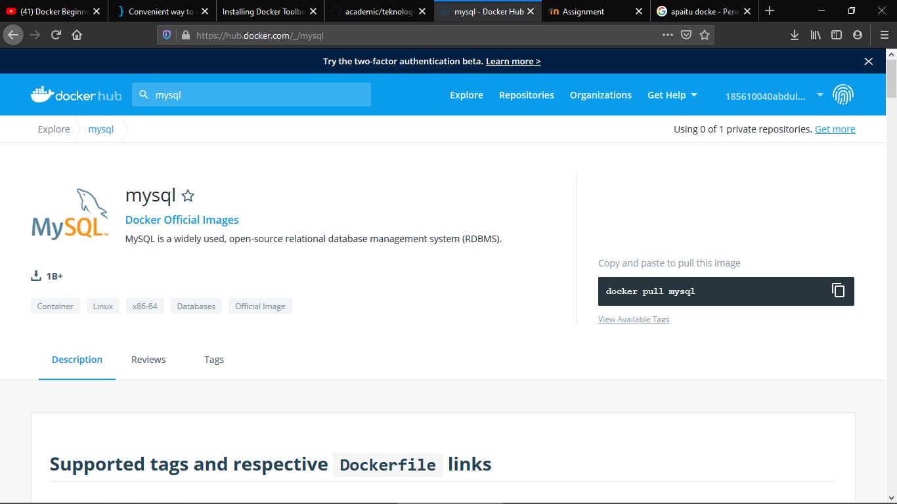

# JAWAB UTS TEKNOLOGICLOUD COMPUTING
___

## 1. Buat account di DockerHub
Buka web resminya di https://hub.docker.com/
Klik signup dipojok kanan atas. Lalu isi id, password, email. ID sebenernya username yang harus unik dan berbeda dari yang lain.

Setelah berhasil kita konfirmasikan akun melalui email yang terdaftar.

Oke kita coba login

Selamat berhasil login. Disini kita bisa upload projek agar nantinya kita tinggal pull aja projekannya.
 
## 2. Pilih image docker yang menarik untuk anda, pull, jalankan di komputer anda
sebelum kita memilih image kita harus mengkoneksikan akun dockerhub kita terlebih dahulu

setelah itu kita bisa memilih image sesuaikeinginan kita 

saya memilih python dan mysql terlihat seperti pada gambar di bawah ini

## 3. Jelaskan langkah-langkah yang anda perlukan untuk menjalankan dockerd, menjalankan docker untuk mengambil (pull) image, menjalankan image menjadi container, menghentikan container.
langak pertama yaitu untuk mengambil image dengan cara "docker pull *nama image*"
setelah itu image akan terdownload engan sendirnya pastikan sudah terkoneksi internet

langkah kedua menjalankan images sebagai container dengan cara mengetik "docker container create --name *nama container* *nama image*" setelah itu akan muncul id nah id tersebut merupakan container yang tadi kita buat

langkah ketiga menghentikan dan menghapus container menghentikan container dengan cara "docker container stop *nama container*" sedangkan untuk menghapusnya bisa lihat cara di bawah ini

## 4. Buat Dockerfile untuk membuat suatu image docker. push image tersebut di DockerHub, setelah itu jelaskan cara-cara anda melakukan hal itu serta jelaskan juga isi dari Dockerfile anda