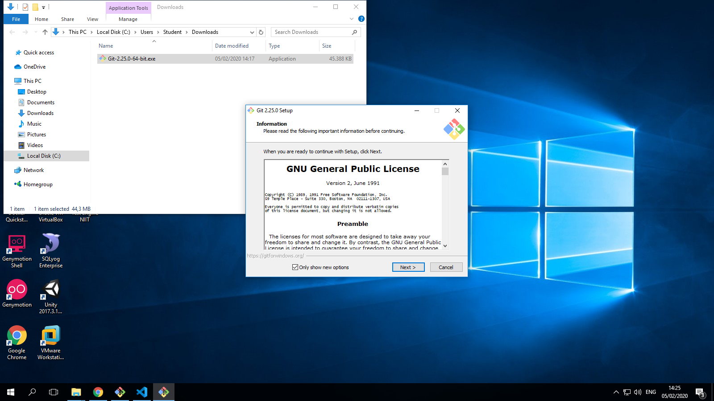
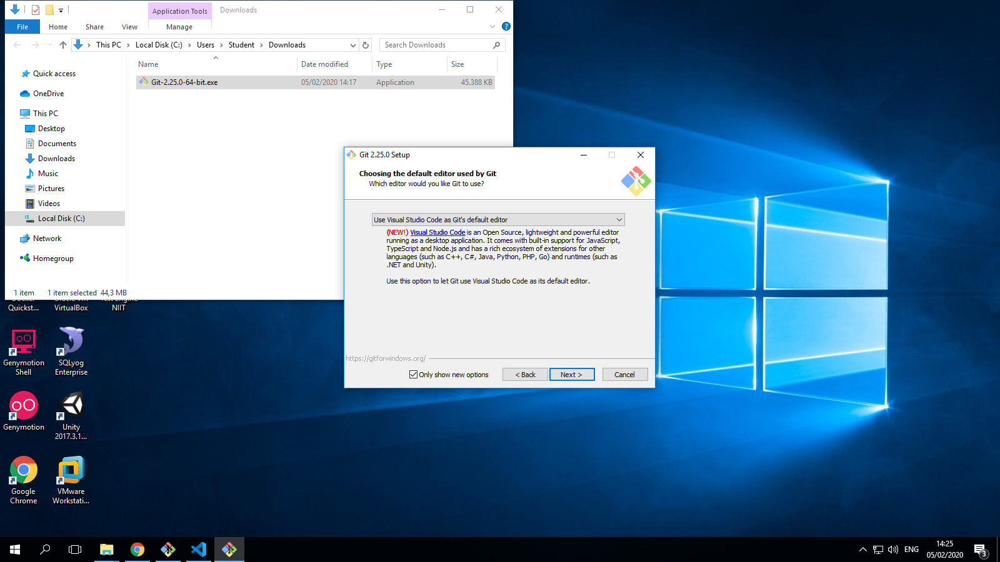
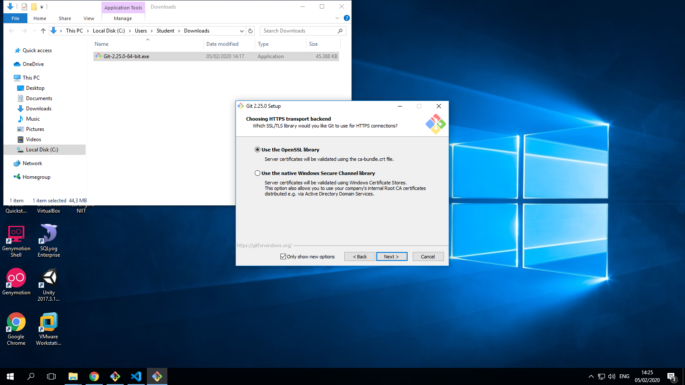
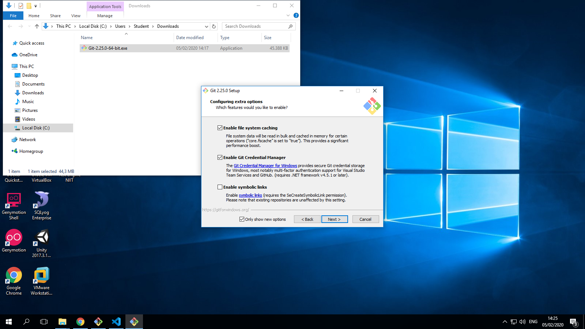
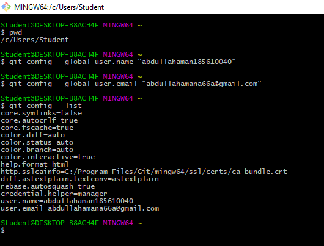
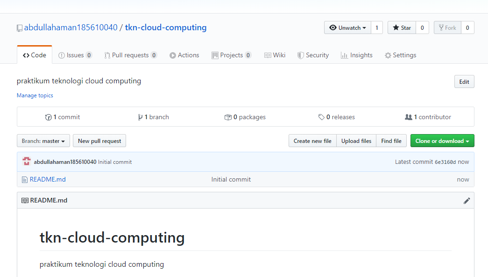
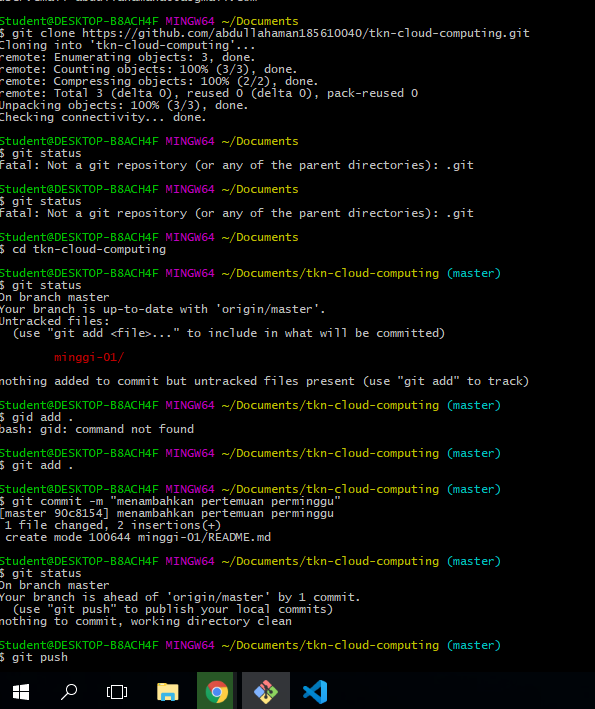
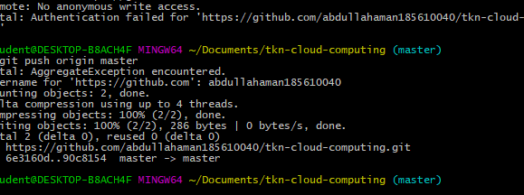
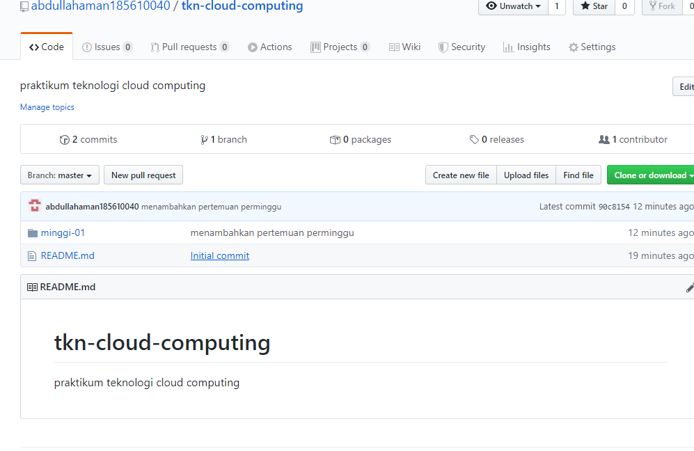

# Latihan 1
---
instalasi GIT 
instalasi git dari awal sampai selesai silahkan di simak ....

klik double pada git.exe maka akan muncul tampilan setelah itu tekan next

Setelah itu, pilih lokasi instalasi. Secara default akan terisi C:\Program Files\Git. klik Next

Pilih komponen. Tidak perlu diubah-ubah, sesuai dengan default saja. Klik pada Next.

Mengisi shortcut untuk menu Start. Gunakan default (Git), ganti jika ingin mengganti - misalnya Git VCS.

Pilih editor yang akan digunakan bersama dengan Git. Pada pilihan ini saya menggunakan visual studio code

Pada saat instalasi, Git menyediakan akses git melalui Bash maupun command prompt. Pilih pilihan kedua supaya bisa menggunakan dari dua antarmuka tersebut.

Pilih OpenSSL untuk HTTPS. Git menggunakan https untuk akes ke repo GitHub atau repo-repo lain (GitLab, Assembla).

Pilih pilihan pertama untuk konversi akhir baris (CR-LF).

Pilih PuTTY untuk terminal yang digunakan untuk mengakses Git Bash.

Untuk opsi ekstra, pilih serta aktifkan 1 dan 2.

Setelah itu proses instalasi akan dilakukan.
jika selesai akan muncul dialog pemberitahuan. Klik pada Finish.

melakukan konfigurasi git

pwd dilakukan untuk melihat direkori yang di gunakan saat itu

git config --global user.name berguna untuk mengisi nama user pada git bash di sarankan mengunakan nama yang sama ketika membuat github agar tidak keliru nantinya.

git config --global user.email berguna untuk mengisi nama email pada git bash di sarankan mengunakan nama email yang sama ketika membuat github agar tidak keliru nantinya.

git config --list berguna untuk meliaht list dan melihat user dan email yang tadi kita masukan

Mengelola Repo Sendiri di Account Sendiri

langkah pertama adealah Klik tanda + pada bagian atas setelah login, pilih New repository

Isikan nama dengan nama tkn-cloud-computing, keterangan dengan isi praktikum teknologi-cloud-computing, serta lisensi.

etelah langkah-langkah tersebut, repo akan dibuat dan bisa diakses menggunakan pola https://github.com/abdullahaman185610040/tkn-cloud-computing. Pada repo tersebut, hanya akan muncul 1 file, yaitu LICENSE. Jika memilih membuat README pada saat langkah ke 2, juga akan muncul README.md. Ada atau tidak ada README.md tidak mempunyai efek apapun pada langkah ini.

setelah itu kita membuat clone agar repo yang tadi kita buat bisa terbuat di folder explorer
selanjutkan masuk ke repo yang tadi telah di clone di folder explorer itu dengan cara cd tkn-cloud-computing

setelah masuk ke repo tersebur maka branchnya langsung berubahmenjadi master, buka file yang di clone tadi di folder explorer dan buat minggu-01 
setelah itu git status untk melihat status nya

selanjutnya di add untuk menambahkan dan commit untuk memasukan data

terakhir melakukan push untuk memasukan data dari git ke github yang ada di web

